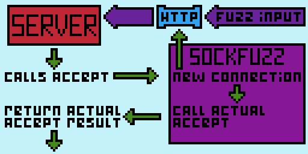
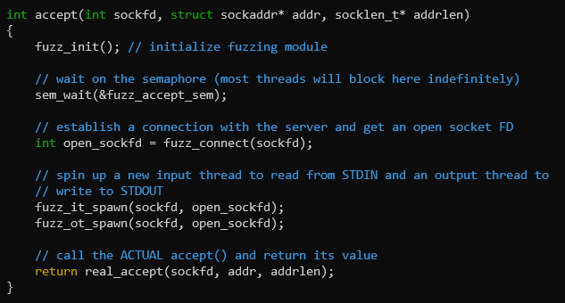
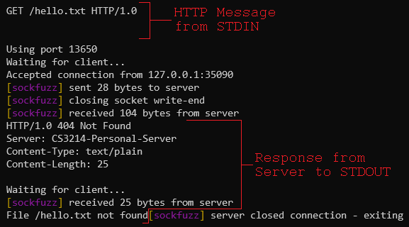

# Concepts: What is sockfuzz?

AFL and AFL++ are excellent at what they do, but they have limitations. One such limitation is how AFL feeds input to the target program: it only works with programs that read from STDIN or from a file. In many cases, this is sufficient; lots of C programs take their input from STDIN or a file.
  
However, this project is about creating a HTTP server. Servers don't read input through a file or STDIN - they read from network sockets. So, the question becomes: how can we force a HTTP server to read input from STDIN, so we can fuzz it with AFL? Additionally, how can we do this without modifying your source code?
  
Sockfuzz is a small C library I developed to solve this problem. It works by "overloading" the `accept` system call and running some extra code to establish an internal connection to your server. Using the special `LD_PRELOAD` environment variable, it can convince your server to use sockfuzz's copy of `accept`, rather than the actual system call.

  
Once called, sockfuzz only allows one thread to finish the call to `accept`. The others are forced to block on a call to `sem_wait`. The one thread that is allowed through runs code that makes a connection to the server, spawns two threads, and calls the _real_ `accept` system call, returning its value. From your point of view, your server behaves just about the same when preloaded with sockfuzz, apart from using only one its threads and setting up that internal connection.
  
A screenshot of sockfuzz's overloaded `accept` function shows what your server's threads will do when they call sockfuzz's version of the function:

  
The two threads that get spawned are designated as the "input thread" and the "output thread." The input thread's job is to read STDIN (until EOF is reached) and feed it through the open network socket to the server. Once STDIN is exhausted, it exits. The output thread's job is to receive bytes from the network socket and send them straight to STDOUT. Once the connection is closed, this thread exits. Collectively, these two threads form a system to send the contents of STDIN to your server and dump the server's response to STDOUT.

